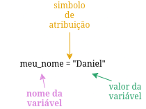

# VARIÁVEIS EM PYTHON

## SUMÁRIO

## INTRODUÇÃO

As variáveis são uma forma de armazenar dados em um programa, por exemplo, com uma variável eu posso armazenar um nome, um número e outras coisas.

## COMO DECLARAR UMA VARIÁVEL

Uma variável é declarada da seguinte maneira:

## TIPOS DE VARIÁVEIS

Estes são alguns dos tipos de dados que uma varíavel pode ter:

|TIPO|O QUE É| EXEMPLO
|-|-|-|
| int | número inteiro | 5, -5 |
| float | número com casas decimais | 2.46, -5.2 |
| complex | número complexo do tipo a + bi | 5+2i |
| string (str) | cadeia de caracteres | "Olá, mundo" |
| bool | Valores verdadeiros ou falsos | True, False |

